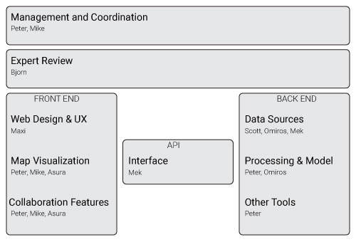

#BLAZE: The Collaborative Open Science Discovery Tool
###Case for Support for the Open Science Prize

##Executive Summary

##Motivation
Discovery is an essential task for every researcher, especially in dynamic research fields such as biomedicine. Currently, there are only a limited number of discovery tools for scientific content that can be used by a mainstream audience. Most researchers still rely on search engines, which satisfy some information needs, but are a poor discovery tool. Search engines display very little information at a glance (usually limited to 10 items per page), and they provide little context and structuring. Search engines are also not suited to the new open science paradigm. They typically ignore non-publication resources like GenBank and other NCBI databases and the results of the discovery process are usually not shared; they become visible only later as references in a publication or reading lists, but again with very little context. Therefore, the discovery process is repeated over and over again, because it lacks the collaborative efficiancies that have become the norm in the open science environment and researchers' time and resources are wasted.

To overcome these problems with the traditional, closed discovery process, we propose BLAZE, the collaborative discovery tool for an open science.

##Overview of BLAZE
BLAZE goes far beyond the functionality of search engines and social reading lists in order to meet the discovery needs of biomedical researchers and students. BLAZE leverages the digital open science ecosystem to provide topical maps of knowledge domains, including not only peer-reviewed literature, but also datasets, presentations, source code, project proposals and media files. The knowledge maps are created automatically using algorithms based on open content to calculate similarities among research content and to derive topical structures. The map visualization reveals relationships between content that is typically hidden in the one-dimensional list returned by a search engine.

BLAZE provides rich context for the discovered content by associating additional information with each resource. For example, the resources are enriched with open (alt)metrics data to indicate the popularity of items and additional facts extracted from open content, like specific species or genes, can be used to reveal hidden relationships between the resources.

Another key feature of the BLAZE tool is that the automatically generated knowledge maps are not static like search engine results. Instead, the maps become a living and crowd-sourced guide to research fields. Researchers can explore, edit and share the maps from a single intuitive interface. For example, a user could explore different topical areas, filter the content based on different metrics, and view individual resources including full text in the same browser window. Users can even modify and annotate the maps and introduce new papers and topical areas. From there, maps are shared on [openknowledgemaps.org](http://openknowledgemaps.org) where they can be extended by other researchers – collaboratively creating layered maps of research fields. The collaboration history of a map is preserved and the maps themselves are open, so users can embed them on their own websites or in open lab books, and export the structure in various open formats into other tools (e.g. Zotero, Open Science Framework).

We believe that making the discovery process open and visible will have many advantages. Researchers are able to reuse previously created maps, saving valuable time and effort. They can also identify other researchers that work in the same area, highlighting potential collaborators long before the research is usually communicated. BLAZE will also improve the meta-dialouge in and across disciplines by making the structure and the vocabulary of domains explicit.

BLAZE will furthermore show the potential of open science for innovation in scholarly communication and discovery. In addition, we believe that this tool will increase the visibility of and awareness for open content. 

##Main Use Case
Sarah is a first-year PhD student in biomedicine, starting her PhD project on the zika virus. First, she needs to catch up with the literature and build a mental model of the field. 

Sarah types "zika", her topic of interest, into BLAZE. Sarah is presented with an interactive map for this field. Blue bubbles represent the main research areas; the closer two bubbles, the closer they are subject-wise. This gives Sarah an overview of the main areas within the field and gives her a mental model of the field.

**(Screen capture from video or illustration?)**

Sarah starts exploring the map using a simple intuitive interaction model. Once she clicks on a research area, she is presented with relevant content in that area. Sarah can see associated content and even read full papers within the same interface.

Sarah identifies a number of articles that warrant their own area. So she goes into edit mode. She adds a new area and drags the papers she found into the newly created bubble. She adds a title and places the area on the map.

Sarah is interrupted by a message from her supervisor Lauren. Lauren suggests a presentation related to the zika virus that she has added to their joint Zotero group. Sarah connects Blaze to her Zotero account and imports the presentation into her map. Blaze automatically places the new content on the map and creates additional areas when needed.

Sarah is done for the day. So she publishes her map for other users to explore and modify on Blaze. She tweets the link: "Hey #biomed community, check out my overview map on the #zika virus: [https://t.co/40FJMC3Ez6](https://t.co/40FJMC3Ez6). Would love to get feedback #phdchat"

The next day, Sarah fires up her e-mail to see that she has received several notifications on her map. She sees that fellow PhD student Amar has added several papers to her map.
She also notices that Tom, who is working on a map on Aedes (the genus of mosquito that transmits the zika virus) has included her map, as a sub-map of his.

Sarah now has a better mental model of her research field and the open resources that will assist her in advancing research on the Zika virus.

##Implementation
###Current Prototype
There is an existing early-stage prototype for BLAZE (see [Head Start](http://github.com/pkraker/Headstart)). Head Start has a JavaScript frontend (built with D3.js) that displays an interactive visualization of a knowledge domain (see [http://openknowledgemaps.org](http://openknowledgemaps.org) for an example). Blue bubbles represent the main research areas; the closer two bubbles, the closer they are subject-wise. The size of the bubbles signifies the relative importance of that area (by number of downloads, clicks, readers etc.). Each area contains a number of relevant resources. A dropdown on the right displays the contents' metadata in list form. This gives users an overview of the main areas within the field and gives them a mental model of the field.

In terms of the interaction design, the visualization follows Shneiderman’s well-tested approach of "overview first, zoom and filter, then details-on- demand". Once you click on a bubble, the visualization zooms in and you are presented with the relevant publication in that area. When clicking on a resource, its metadata and abstract are presented in the right-hand pane. The full text can be retrieved by clicking on the thumbnail in the metadata panel. By clicking on the white background, users can zoom out and inspect another area. In addition, a user can filter the publications by entering terms in the search field on top of the list. Only publications that contain all of the search terms are displayed within the bubbles and the list. The list can also be sorted by title, area, and number of readers to facilitate exploration.

The backend of the visualization is written in PHP and R. A preprocessing component is responsible for creating the data for the visualization. It connects to the PLOS API to retrieve open content. It then proceeds to calculate similarities between papers using the R tm package. **(Maybe elaborate on how the similarity is calculated?)** Based on these similarities, the spatial representation and the sub-areas are calculated using ordination and clustering techniques. A naming component finally determines the label for each cluster using keywords. After processing, the representation is saved in a SQLite database. The full stack implementation can be seen on [Open Knowledge Maps](http://openknowledgemaps.org/mozfest). This version allows you to create an interactive map based on a PLOS search result and is able to keep a history of previously created maps.

###Data Sources
As stated above, we use R in the backend to access open content on the web. We use many software packages produced by rOpenSci, including the ability to search for scholarly content against the following engines (with wide diversity of journals):

* Crossref (~78 million records)
* Pubmed (~25 million records)
* EuroPubmed (~30 million records)

In addition, we can query against pre-print services, including:

* arXiv
* Biorxiv
* Peerj Preprints. 
 
The rOpenSci text mining suite of packages allows retrieval of open access full text content via those search engines listed above. 

rOpenSci packages also allow for search against repositories that expose various other types of resources (datasets, presentations, source code, project proposals and media files), including - but not limited to: 

* Figshare
* Dryad
* DataONE

Using the rAltmetric and alm packages, we will retrieve altmetrics data from the following resources:

* Altmetric.com
* PLOS
* Crossref
* eLife
* PKP
* Pensoft

We will annotate/enrich publications with:

* MESH terms (for PubMED pubs utilizing their API)
* References (for PubMED pubs utilizing their API)
* pdbCodes (fulltext analysis using OpenAIRE API)
* Funding (Grant) Info for WT, EU, NIH (fulltext analysis using the OpenAIRE and Crossref APIs)
  

###Planned Improvements
####Expand Content Sources
In the first phase of the Open Science Price, we will extend both the backend and the frontend of the BLAZE tool. One of the primary objectives is to extend BLAZE to include other open content sources, including non-publication content, that are supported by rOpenSci (see above). This will require changes both to the backend calculations and data representation as well as to the frontend visualization. The first step will be to develop a data model that incorporates heterogenous data sources. Part of this will involve adding connector(s) to content mining APIs and altmetrics APIs through rOpenSci to provide additional metadata for each resource. We will then extend the map visualization to enable highlighting of contextual facts and to create additional links between the papers. For example, a researcher might want to highlight all papers that contain the same species, focus on recently published material, or view the citation links between papers. Researchers might also want to cluster the resources based on a metric other than keyword similarity, like readership, type of content (i.e. paper, data set, presentation, etc.) or funding source. All of this will be enabled through the interactive BLAZE interface.

####Editing and Sharing
To unleash the full potential of BLAZE, one of the primary goals during phase one of the Open Science Prize is to enable editing and sharing of knowledge maps. This will also require adaptations to the backend database operations and the frontend user interaction. On the front end, we will enable an edit mode that allows researchers to manually add content to the map, modify or add metadata to content, like tags, and create new clusters. The editing history will be preserved in a Wikipedia-like model to allow collaborative building of knowledge maps. The maps themselves will be saved at [Open Knowledge Maps](http://openknowledgemaps.org/mozfest) where they can me browsed by other researchers and can serve as a starting point for other researchers' exploration. We will also add integration with existing tools in the open digital ecosystem, including osf.io, Zotero, and ORCID, so that BLAZE will fit seemlessly into researchers' current workflows. BLAZE strives to be completely open, so we will also add functionality to export the map and the underlying data in various open formats, so that, for example, a researcher could embed a map on her personal website.

###Work Plan
Development of BLAZE will take place in the [Head Start](http://github.com/pkraker/Headstart) repository on Github. The concrete targets for developing the innovation will be published as Github issues on this repository. A summary of the major work components is illustrated below, along with each team member's area of primary contribution.

##Licensing
The code will be made available on Github under the license of the current project (LGPL v3). The visualizations will be released under CC-BY 4.0 with the exception of the contained content which of course retains its original copyright.

