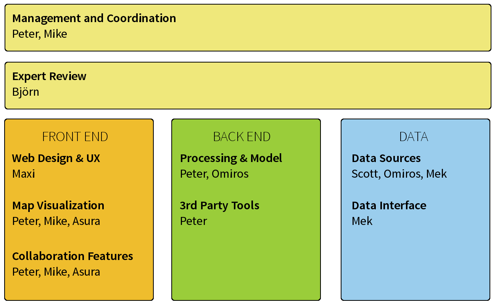
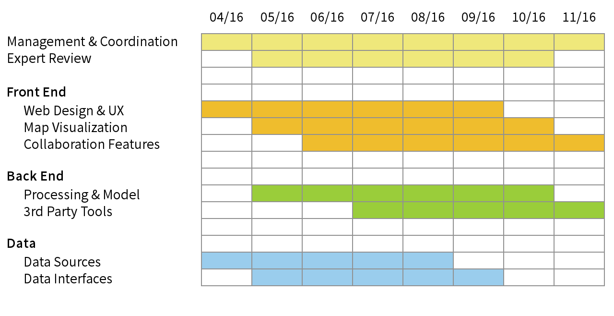

#BLAZE: The Comprehensive Open Science Discovery Tool

###Case for Support for the Open Science Prize

#####Team "Open Discovery":
Peter Kraker, Mike Skaug, Scott Chamberlain, Maxi Schramm, Michael Karpeles, Omiros Metaxas, Asura Enkhbayar & Björn Brembs

####Executive Summary

Discovery is an essential task for every researcher, especially in dynamic research fields such as biomedicine. Currently, however, there are very few discover tools that can be used by a mainstream audience, most notably search engines. The problem with search engines is that they present resources in a linear, one-dimensional way, making it necessary to sift through every item in a list. Another problem is that the results of the traditional discovery process are usually closed. Therefore, the discovery process is repeated over and over again by different researchers, taking away valuable time and resources from the actual research. To solve these challenges and bring the discovery process into the open science era, we propose BLAZE, the comprehensive open science discovery tool. BLAZE will leverage the existing open science ecosystem to provide multi-dimensional topical maps of research fields, involving not only publications, but also datasets, presentations, source code and media files. BLAZE will provide a single, intuitive interface for researchers to explore, edit and share maps. The edit history of a map will be preserved to allow Wikipedia style collaboration. The maps themselves will be open, so users can embed them on their own websites and export the structure into other open science tools. Opening the discovery process will enable researchers to reuse maps, saving valuable time and effort because they can build on top of each other’s work. Furthermore, they will be able identify collaborators long before the research is usually communicated. There is an existing, early-stage protoype for BLAZE and with the Open Science Prize, we plan to develop this prototype into a comprehensive tool. BLAZE will show the enormous potential of open science for innovation in scholarly communication by providing a structured, open and multi-dimensional approach to discovery.

*Open science, all the way - the proposal and the supplementary files are hosted on Github: [http://github.com/pkraker/open-disovery](http://github.com/pkraker/open-disovery)*

##Motivation
Discovery is an essential task for every researcher, especially in dynamic research fields such as biomedicine. For example, researchers often need to get an overview of a research field (e.g. at the beginning of their PhD, or later on when venturing in a neighbouring field) or a certain topic (e.g. when writing the state-of-the-art for a project proposal).

Currently, there are only a limited number of discovery tools for scientific content that can be used by a mainstream audience. Most researchers still rely on scholarly search engines, which satisfy some information needs, but are a poor discovery tool. Search engines present resources in a linear, one-dimensional way, making it necessary to sift through every item in the list. They provide little context apart from basic metadata, which makes it hard to infer the topical structure of the content. Most scholarly search engines are also not suited to the new open science paradigm, in which not only the written results are published, but also data, source code, images etc.: scholarly search engines, however, typically ignore non-publication resources like GenBank and other NCBI databases.

Another problem is that the results of the discovery process are usually not shared; they become visible only later as references in a publication or reading lists, but again with very little context and structure. Therefore, the discovery process is repeated over and over again by different researchers, because it lacks the collaborative efficiencies that have become the norm in the open science environment and researchers' time and resources are wasted.

To overcome these problems with the traditional, closed discovery process, we propose BLAZE, the collaborative discovery tool for open science.

##Overview of BLAZE
BLAZE goes far beyond the functionality of search engines and social reading lists in order to meet the discovery needs of biomedical researchers and students. BLAZE leverages the digital open science ecosystem to provide topical maps of knowledge domains, including not only peer-reviewed literature, but also datasets, presentations, source code, project proposals and media files. The knowledge maps are created automatically using algorithms based on open content to calculate similarities among research content and to derive topical structures. The map visualization reveals relationships between content that is typically hidden in the one-dimensional list returned by a search engine.

BLAZE provides rich context for the discovered content by associating additional information with each resource. For example, the resources are enriched with open (alt)metrics data to indicate the popularity of items and additional facts extracted from open content, like specific species or genes, can be used to uncover hidden connections between the resources.

Another key feature of the BLAZE tool is that the automatically generated knowledge maps are not static like search engine results. Instead, the maps become a living and crowd-sourced guide to research fields. Researchers can explore, edit and share the maps from a single intuitive interface. For example, a user could explore different topical areas, filter the content based on different metrics, and view individual resources including full text in the same browser window. Users can even modify and annotate the maps and introduce new papers and topical areas. From there, maps are shared on [openknowledgemaps.org](http://openknowledgemaps.org) where they can be extended by other researchers – collaboratively creating layered maps of research fields. The collaboration history of a map is preserved and the maps themselves are open, so users can embed them on their own websites or in open lab books, and export the structure in various open formats into other tools (e.g. Zotero, Open Science Framework).

We believe that making the discovery process open and visible will have many advantages. Researchers will be able to reuse previously created maps, saving valuable time and effort. They will also be able to identify other researchers that work in the same area, highlighting potential collaborators long before the research is usually communicated. BLAZE will also improve the meta-dialouge in and across disciplines by making the structure and the vocabulary of domains explicit.

BLAZE will furthermore show the enormous potential of open science for innovation in scholarly communication and discovery. In addition, we believe that this tool will increase the visibility of and awareness for open content. 

##Main Use Case
Sarah is a first-year PhD student in biomedicine, starting her PhD project on the zika virus. First, she needs to catch up with the literature and build a mental model of the field. 

Sarah types "zika", her topic of interest, into BLAZE. Sarah is presented with an interactive map for this field. Blue bubbles represent the main research areas; the closer two bubbles, the closer they are subject-wise. This gives Sarah an overview of the main areas within the field and gives her a mental model of the field.

Sarah starts exploring the map using a simple intuitive interaction model. Once she clicks on a research area, she is presented with relevant content in that area. Sarah can see associated content and even read full papers within the same interface.

Sarah identifies a number of articles that warrant their own area. So she goes into edit mode. She adds a new area and drags the papers she found into the newly created bubble. She adds a title and places the area on the map.

Sarah is interrupted by a message from her supervisor Lauren. Lauren suggests a presentation related to the zika virus that she has added to their joint Zotero group. Sarah connects Blaze to her Zotero account and imports the presentation into her map. Blaze automatically places the new content on the map and creates additional areas when needed.

Sarah is done for the day, so she publishes her map for other users to explore and modify on Blaze. She tweets the link: "Hey #biomed community, check out my overview map on the #zika virus: [https://t.co/40FJMC3Ez6](https://t.co/40FJMC3Ez6). Would love to get feedback #phdchat"

The next day, Sarah fires up her e-mail to see that she has received several notifications on her map. She sees that fellow PhD student Amar has added several papers to her map.
She also notices that Tom, who is working on a map on Aedes (the genus of mosquito that transmits the zika virus) has included her map, as a sub-map of his.

Sarah now has a better mental model of her research field and the open resources that will assist her in advancing research on the Zika virus.

##Implementation
###Current Prototype
There is an existing early-stage prototype for BLAZE (see [http://openknowledgemaps.org/search](http://openknowledgemaps.org/search). The prototype creates an interactive visualization based on a PLOS search result. The prototype has a JavaScript frontend built with [D3.js](http://d3js.org). Blue bubbles represent the main research areas; the closer two bubbles, the closer they are subject-wise. The size of the bubbles signifies the relative importance of that area (by number of downloads, clicks, readers etc.). Each area contains a number of relevant resources. A dropdown on the right displays the contents' metadata in list form. This gives users an overview of the main areas within the field and gives them a mental model of the field.

In terms of the interaction design, the visualization follows [Shneiderman’s well-tested approach](http://drum.lib.umd.edu/bitstream/handle/1903/466/CS-TR-3665.pdf) of "overview first, zoom and filter, then details-on- demand". Once you click on a bubble, the visualization zooms in and you are presented with the relevant publication in that area. When clicking on a resource, its metadata and abstract are presented in the right-hand pane. The full text can be retrieved by clicking on the thumbnail in the metadata panel. By clicking on the white background, users can zoom out and inspect another area. In addition, a user can filter the publications by entering terms in the search field on top of the list. Only publications that contain all of the search terms are displayed within the bubbles and the list. The list can also be sorted by title, area, and number of readers to facilitate exploration.

The backend of the visualization is written in PHP and R. A preprocessing component is responsible for creating the data for the visualization. It connects to the [PLOS API](http://api.plos.org/) via the [rplos](https://ropensci.org/tutorials/rplos_tutorial.html) to retrieve metadata and fulltext. It then proceeds to calculate cosine similarity between papers based on a term-document matrix using the [R tm package](https://cran.r-project.org/web/packages/tm/index.html). Based on the similarity matrix, the spatial representation and the sub-areas are calculated using ordination and clustering techniques. A naming component finally determines the label for each cluster using keywords. After processing, the representation is saved in a SQLite database. The source code for the prototype is hosted on Github: [http://github.com/pkraker/Headstart](http://github.com/pkraker/Headstart)

###Planned Improvements

In the first phase of the Open Science Price, we will extend both the backend and the frontend of the existing early-stage prototype. 

####Expand Content Sources
One of the primary objectives is to extend the existing prototype to incoporate further open content sources, including non-publication content. We use many software packages produced by [rOpenSci](http://ropensci.org), including the ability to search for scholarly content against the following engines:

* Crossref
* Pubmed
* EuroPubmed

In addition, we will query against pre-print services, including:

* arXiv
* Biorxiv
* Peerj Preprints

Emplyoing the rOpenSci text mining suite we will retrieve open access full text content via those search engines listed above.

We will also use rOpenSci packages for search against repositories that expose various other types of resources (datasets, presentations, source code, media files...), including - but not limited to: 

* Figshare
* Dryad
* DataONE

This means that we will also need to develop a data model that incorporates heterogenous data sources. Part of this will involve adding connector(s) to altmetrics APIs through rOpenSci to provide additional context for each resource. Using the [rAltmetric](http://ropensci.github.io/rAltmetric/) and [alm](https://ropensci.org/tutorials/alm_tutorial.html) packages, we will retrieve altmetrics data from the following resources:

* Altmetric.com
* PLOS
* Crossref
* eLife
* PKP
* Pensoft
 
Moreover, we will utilize OpenAIRE services to further annotate/enrich publications with additional side information:

* References
* MESH terms
* pdbCodes
* Funding (Grant) Info for NIH, Wellcome Trust, EU

The content will then be exposed via an API to the other components of BLAZE.

####Improving Topic Detection and Similarity Analysis

Another objetive is to improve the automatic creation of maps. We plan to utilize a novel, multi-view probabilistic topic modeling (MV-PTM) engine that jointly analyzes massive collections of documents and related side information, and identifies hidden themes (topics) that characterize them. Side information ("views") may be of different kinds (e.g. structured or unstructured attributes and metadata), have hierarchies or taxonomies (e.g. MESH terms), be of different modalities (e.g. images), and form networks (e.g. citations). Multiple views can help to explain each other and the discovered multi-view topics are more coherent and interpretable, uncovering concepts not resolved by traditional, textual-only topic models. 

Proposed MV-PTM engine has already been used in real world applications, e.g. evaluation of EU-funded projects or publication policy making, and on top of real world massive datasets, e.g. the ACM corpus and open access PubMed. In our case, we plan to utilize proposed engine to:

1. Identify relevant content: Based on MV-PTM we will enhance similarity analysis and relevant content identification. Thus, we will also be able to support topic-based search or search by example (specifying one or more publications). 
2. Eliminate "duplicate" research areas: Human-based annotation and clustering in large research spaces may lead to duplicate entries on the map. We will utilize MV-PTM to identify overlapping research areas or clusters. 

####Map Extensions
We will extend the map visualization to enable highlighting of contextual facts and to create additional links between the papers. For example, a researcher might want to highlight all papers that contain the same species, focus on recently published material, or view the citation links between papers. Researchers might also want to cluster the resources based on a metric other than keyword similarity, like readership, type of content (i.e. paper, data set, presentation, etc.) or funding source. All of this will be enabled through the interactive BLAZE frontend interface.

####Map Editing and Sharing
To unleash the full potential of BLAZE, one of the primary goals during phase one of the Open Science Prize is to enable editing and sharing of knowledge maps. This will also require adaptations to the backend database operations and the frontend user interaction. On the front end, we will enable an edit mode that allows researchers to manually add content to the map, modify or add metadata to content, like tags, and create new clusters. The editing history will be preserved in a Wikipedia-like model to allow collaborative building of knowledge maps. The maps themselves will be saved at [Open Knowledge Maps](http://openknowledgemaps.org/mozfest) where they can me browsed by other researchers and can serve as a starting point for other researchers' exploration. 

We will also add integration with existing tools in the open digital ecosystem, including the [Open Science Framework](https://osf.io/), [Zotero](https://www.zotero.org/), and [ORCID](http://orcid.org/), so that BLAZE will fit seemlessly into researchers' current workflows. BLAZE strives to be completely open, so we will also add functionality to export the map and the underlying data in various open formats, so that, for example, a researcher could embed a map on her personal website.

##Architecture
### Data Aggregation & Metadata

**Description:** A JSON REST API or Graphql endpoint which wraps various data sources, such as Scott's [rOpenSci fulltext library](https://github.com/ropensci/fulltext).

**URL:** https://api.archivelab.org/scholar

**Stack:** Python, Flask, Postgres, SQLAlchemy, R

**Github:** https://github.com/ArchiveLabs/scholar.archivelab.org

### BLAZE Backend + Database

**Description:** A REST API to a database of user accounts, preferences, and curated topic maps

**URL:** https://api.openknowledgemaps.org

**Stack:** PHP, MySQL

**Github:** https://github.com/pkraker/BlazeServer (to be created)

### BLAZE Frontend

**Description:** A standalone, serverless SPA (single page app)

**URL:** https://openknowledgemaps.org

**Stack:** React, D3.js, JQuery

**Github:** https://github.com/pkraker/Blaze (to be created)

##Work Plan
Development of BLAZE will take place on Github in the repositories outlined above. The concrete targets for developing the innovation will be published as Github issues in these repositories. A summary of the major work components is illustrated below, along with each team member's area of primary contribution.

The development schedule is shown in the timeline below:

##Licensing
The code will be made available on Github under the license of the existing prototype (LGPL v3). The visualizations will be released under CC-BY 4.0 - with the exception of the contained content, which of course retains its original license.
