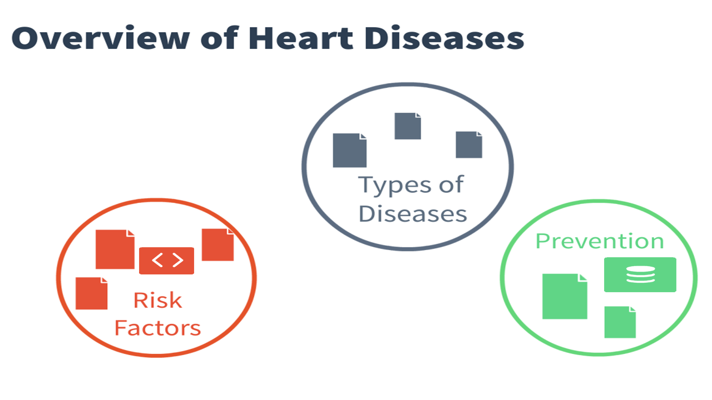
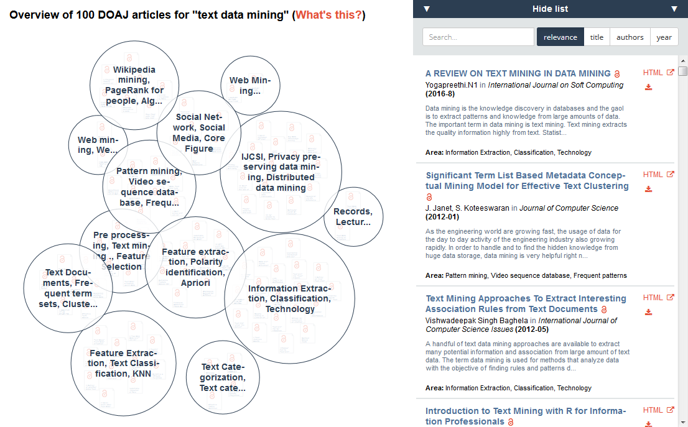
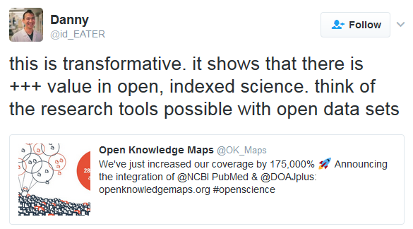
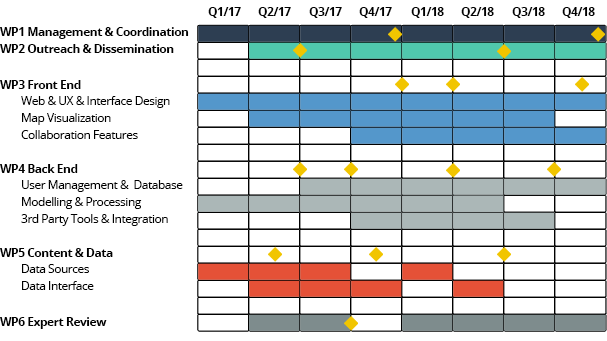

# Roadmap

*by the [Open Knowledge Maps team](http://openknowledgemaps.org/team)*

Version: 2.0 beta

## Motivation

**Our motivation is that the tools for exploring and discovering scientific content are seriously lacking.** For example, it is very hard to get an overview of a research field. With traditional, list-based search engines, users have to examine articles and their relationships by hand, which is a time-consuming process. Researchers are struggling with this task, but at least they have a community of peers that supports them. **People outside academia are usually on their own, and therefore often lost.** Take the example of patients who would like to learn about the newest research on their illness. In the worst case, they don’t discover a life-saving treatment, because the paper describing it was buried far down the results list.

To overcome these issues, we propose to use so-called knowledge maps, a powerful tool for exploration and discovery. **Knowledge maps provide an instant overview of a field by showing the main areas of the field at a glance, and papers related to each area** (see the example map below).

## Vision

We want to provide **a large-scale, web-based system of open, interactive and interlinked knowledge maps for every research topic, every field and every discipline**. This system will enable users not only to get an overview of a field, but also to discover trends, and to identify important researchers within a field. Furthermore, we will highlight open content, including non-publication resources such as data, video, and images. **Users will be able to conduct the whole discovery process in a single browser tab.**

**In addition we want to turn discovery into an open and collaborative process.** Most people, including researchers, students, journalists, librarians and citizens are currently tackling discovery on their own – and therefore repeat the same process over and over again. By sharing the results of our discoveries, we can save valuable time and build on top of each other’s’ knowledge. **We want to create a space for collective knowledge mapping, where different individuals and communities come together;** for example researchers and medical librarians who will collaboratively map the newest research on a certain disease and openly share their efforts for the benefit of others affected by this disease.

We believe that it is a critical time that we are creating this platform in. There are several closed solutions for providing visual overviews that are being developed right now. **If we do not provide an open alternative in time, we risk being stuck with proprietary solutions and wasted public money for decades.**

## Existing Work
**We are not starting this project from scratch.** We have been developing the system as an open group of volunteers and published the results on our website [http://openknowledgemaps.org]().  Currently, users can create a knowledge map for a topic of their choice based on either PubMed or the Directory of Open Access Journals. Our software retrieves the 100 most relevant results for a topic and creates a knowledge map based on textual similarity between the records. The map is intended to give users a head start in their literature research.

Open Knowledge Maps has become an international collaboration with team members, advisors and partners from all around the world. For more information, visit [our team page](http://openknowledgemaps.org/team).

Over the past year, we have created a lot of excitement in the community. **We were featured on the front pages of Reddit and HackerNews.** In November alone, we recorded over 44,000 visits to the site, and more than 25,000 maps have been created on the site to date. We have also introduced Open Knowledge Maps at numerous events including MozFest, OpenCon & OpenCon Berlin, and NetzPat Vienna. In total, over 230 people attended our workshops and sessions. The positive feedback was overwhelming: we’ve received hundreds of tweets with enthusiastic responses from users and many users have provided feedback via e-mail and by opening Github issues.

## Broad Overview

Over the next two years, we want to further develop Open Knowledge Maps into a collaborative, all-encompassing open discovery system. This includes **further broadening our coverage of content sources.** We are looking to connect to the BASE search engine, which covers more than 100 million publications, 60% of which are open access. We will also include non-publication resources from archives such as zenodo using an innovative data fusion model. We also want to **improve topic detection and similarity analysis**, by integrating relevant context information such as ontologies.

We are going to **extend the map visualizations** to include additional links between papers, for example citations and facts extracted from open content. We will also **add integration with existing tools in the open digital ecosystem**, including the Open Science Framework, Zotero, and ORCID, so that Open Knowledge Maps will fit seamlessly into researchers' current workflows. We will also **provide an API** of our own for other services to use. A strong focus will be on **developing the collaborative features**. On the front end, we will enable an edit mode that allows researchers to manually add content to the map, modify or add metadata to content, like tags, and create new clusters. The editing history will be preserved in a Wikipedia-like model to allow collaborative building of knowledge maps. For an overview of the collaborative editing functionality, please see this video.

We also want to grow as a community and as an organization. We will have already established an advisory board, and in the coming year we also want to **establish a community of enthusiasts** to guide the development of Open Knowledge Maps in a human-centered design process. Another concrete action is to **bootstrap mapping parties** (similar to those in the Open Street Maps project), where people get together to jointly map an underrepresented research field, for example a neglected disease.

## The Role of Openness

As mentioned before, Open Knowledge Maps is a public good, which we build to support science and society. **Openness is therefore at the very core of our idea.** We are openly sharing data, source code, and content that is being created. The code is being made available on Github under LGPL v3. The visualizations are released under CC BY. The underlying knowledge structures will be made available in various open formats under CC0, so that they can be easily reused.

Openness will also play an important role in all social activities, which will be organized in the spirit of open knowledge events. Mapping parties, for example, will be free of charge and there will be no restriction for attendees, other than restrictions that pertain to a specific venue (i.e. the number of people that can attend will be determined by the venue’s capacity).

## Work Plan

**Work is divided into six work packages.** A summary of the major work components is illustrated below, along with each team member's area of primary contribution: 

**Milestones** for each work package are shown in the table below:

| Work Package 	| Milestones 	|
|----------------------------------	|----------------------------------------------------------------------------------------------------------------------------------------------	|
| WP1: Management and coordination 	| M1.1: Yearly report 1 (Q4/17) M1.2: Yearly report 2 (Q4/18) 	|
| WP2: Outreach and dissemination 	| M2.1: Start of community of enthusiasts (Q2/17) M2.2: Mapping party concept (Q2/18) 	|
| WP3: Frontend development 	| M3.1: Map sharing features (Q4/17) M3.2: Mobile version (Q1/2018) M3.3: Map editing features (Q4/18) 	|
| WP4: Backend development 	| M4.1: Data fusion model (Q2/17) M4.2: Incorporation of ontologies (Q3/17) M4.3: User registration (Q1/18) M4.4: Integration with OSF (Q3/18) 	|
| WP5: Content and data sources 	| M5.1: BASE Integration (Q2/17) M5.2: Backend API (Q4/17) M5.3 Integration of non-publication res. (Q2/18) 	|
| WP6: Expert Review 	| M6.1: User testing report (Q3 /17) 	|

## Timeline

## Success Metrics
| Metric                                                    | After year 1 | After year 2 |
|-----------------------------------------------------------|-------------:|-------------:|
| Number of covered research artefacts                      |   80 million |  150 million |
| Number of maps generated                                  |         100K |         300K |
| Number of registered users                                |          N/A |          80K |
| Number of monthly visitors                                |          40K |         120K |
| Number of people participating in the Enthusiasts program |          500 |        2,000 |
| Number of Open Knowledge Maps events worldwide            |           30 |           90 |

## High-Level Risks & Mitigation
* **If we build it, will they come?** We already see considerable interest in the project (see above). We will also follow best practices, human-centered design and expanding our 
* community of advisors and enthusiasts to guide us in the development. 
* **Technical challenges related to building a large-scale system:** It will be crucial to address scalability from the start and build it into the core architecture. We will use a distributed agile process and adopt strategies of successful open source projects. 
* **Not enough open data available or low data quality:** Currently, we assume that more open data and content will be published. We have shown in the past that we are able to create meaningful knowledge maps from very few data points and we are planning to use context information to improve records of low quality.